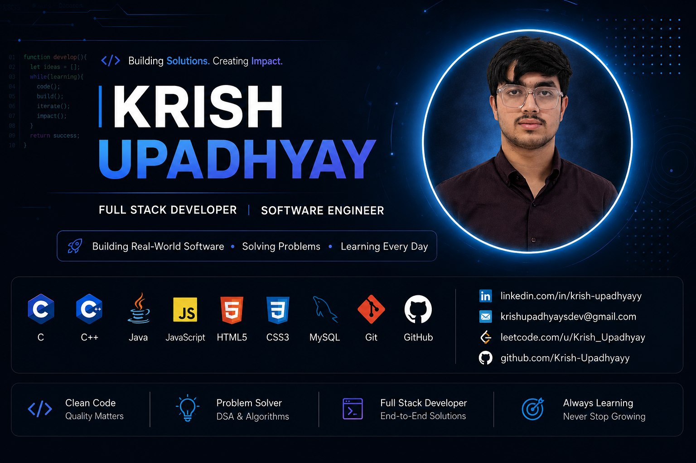

  

<h1 align="center">Hello , I'm Krish Upadhyay</h1>

<h3 align="center">
Full Stack Developer • Software Engineer • Problem Solver
</h3>

I'm a Computer Science undergraduate passionate about building software that solves real-world problems. I enjoy creating full-stack applications, exploring APIs, practicing Data Structures & Algorithms, and continuously improving through hands-on projects.

  

---

# 🚀 About Me

🎓 **B.Tech Computer Science Student** (2025–2029)

💻 Aspiring **Full Stack Software Developer**

🌱 **Currently Learning**
- React.js
- Backend Development
- Advanced JavaScript
- System Design Fundamentals

🧠 Practicing **Data Structures & Algorithms** daily.

🎯 Goal: **Build impactful software and secure a Software Engineering Internship.**

---

# 🏆 GitHub Trophies

# 💻 Tech Stack

### 👨‍💻 Programming Languages

### 🎨 Frontend

### 🗄️ Databases

### 🛠️ Tools & Platforms

---

# 📌 Featured Projects

### 🔍 GitHub User Explorer

⭐ Search GitHub profiles using the GitHub REST API with repository insights, language statistics, and responsive UI.

**Tech:** HTML • CSS • JavaScript • REST API

## 🌦 Weather App
Responsive weather dashboard with real-time weather data, API integration, loading states, and error handling.

**Tech Stack:** HTML • CSS • JavaScript

---

## 🏧 ATM Management System
Console-based ATM simulation featuring authentication, deposits, withdrawals, mini statements, PIN change, and persistent file handling.

**Tech Stack:** C • File Handling

---

## 🧮 Nova Calculator
Modern responsive calculator with calculation history and clean UI.

**Tech Stack:** HTML • CSS • JavaScript

---

## 🎉 Event Horizon
Responsive event management landing page with engaging UI and optimized performance.

**Tech Stack:** HTML • CSS • JavaScript

---

# 📊 GitHub Analytics

---

# 🧠 LeetCode Stats

---

# 🏆 Achievements & Certifications

🏅 IBM Front-End Developer Certification

🏅 IBM JavaScript Fundamentals

🏅 RIFT 24-Hour Hackathon Participant

🏅 Built multiple software development and web development projects

---

# 🌱 Currently Working On

- 🚀 Full Stack Development
- ⚛️ React.js
- 🌐 REST APIs
- 📊 SQL & Database Design
- 💡 Advanced JavaScript
- 📦 Production-ready Projects

---

# 📫 Connect With Me

---

# 💡 Developer Philosophy

> *"Every project is an opportunity to learn something new. I believe consistent learning, clean code, and thoughtful problem-solving are the foundation of becoming a great software engineer."*

---

  
⭐ Thanks for visiting my profile!   
If you like my work, consider exploring my repositories and connecting with me.

